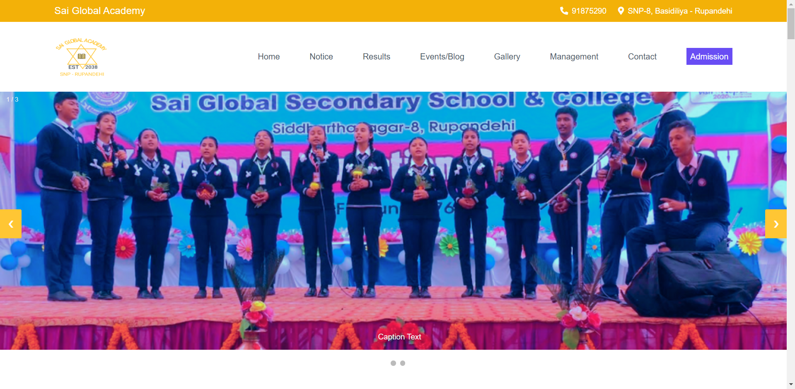

<!-- [live](https://alidhuniya.github.io/schoolWebsite-StrapiCMS/) -->

#  Dynamic School Website

> ## Dynamic School Website with Strapi Headless cms and VanillaJS

 # [See Live](https://alidhuniya.github.io/schoolWebsite-StrapiCMS/)

 
 
 # Blog 
 
 ## [how-i-build-a-school-website-with-strapi-cms-using-vanilla-js](https://dev.to/alidhuniya/how-i-build-a-school-website-with-strapi-cms-using-vanilla-js-2k57)

# Tech Stack

 ### HTML
 ### CSS/SASS
 ### JS
 ### Strapi Headless CMS

 # Other

 ### Font-Awesome Icons

 # Backend Strapi Model 
 ### [Backend Strapi Content Model](https://github.com/Alidhuniya/schoolWebsite-strapi-Backend-Model)

 # What you'll Learn

   **- REST APIs**

   **- How to read DOCS?**

   **- How to work with Strapi CMS?**

   **- JS DOM**

   **- ES6 Syntax**

   **- ES6 Modules**

   **- How to Fetch Data and show on the Screen?**

   **- Async/Await**

   **-  Fetch API**

   **- Responsive Design**

   **- SASS(SCSS) modules**

   **- HTML structure with meaningful Classes**

   **- BEM Convention**

   **- Get Figma Design File.Design by myself**

